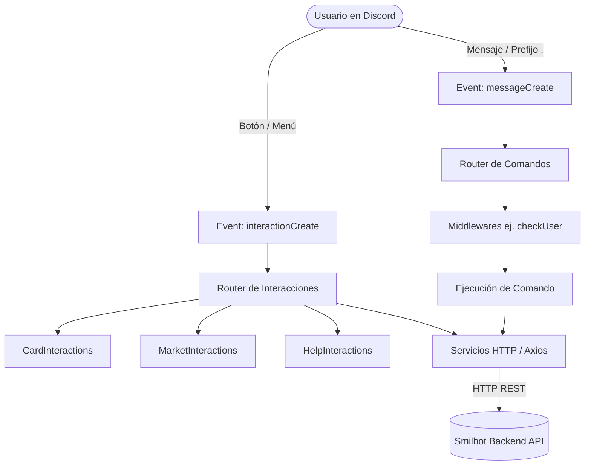

# 🏛️ Arquitectura General del Bot

## 1. Visión Global

Smilbot 2.0 está diseñado bajo un modelo modular, orientado a eventos y tipado estrictamente en **TypeScript** con **Discord.js v14**.

El bot actúa como cliente de presentación e interacción para Discord, delegando la persistencia de datos y la lógica de negocio contable a un **Backend REST API**.



---

## 2. Estructura de Directorios (`src/`)

```text
src/
├── commands/         # Definición de comandos organizados por categorías
│   ├── economy/      # balance, dailyBalance, stats, getCard, myCards, show, allCards, market
│   ├── fun/          # ping
│   ├── player/       # play, stop
│   └── utility/      # help
├── components/       # Constructores de componentes de UI de Discord
│   ├── buttons/      # Botones interactivos (paginación, abrir mercado, comprar)
│   ├── embeds/       # Embed builders estilizados
│   └── pagination/   # Lógica genérica de paginación
├── events/           # Listeners de eventos de Discord.js y discord-player
│   ├── client/       # ready, messageCreate, interactionCreate
│   └── player/       # playerStart, playerError, disconnect, etc.
├── handlers/         # Manejadores de interacciones complejas con estado
├── middlewares/      # Interceptores antes de ejecutar comandos (ej. checkUser)
├── services/         # Clientes de consumo HTTP hacia la API REST
├── types/            # Interfaces de dominio y tipos de TypeScript
└── utils/            # Funciones auxiliares y formateadores
```

---

## 3. Flujo de Ejecución de Comandos

1. **Evento `messageCreate`:** Detecta si el mensaje inicia con el prefijo configurado (`.`).
2. **Parsing:** Extrae el nombre del comando y los argumentos.
3. **Resolución:** Busca el comando por `name` o `aliases`.
4. **Middlewares:** Ejecuta en cadena los middlewares configurados en el comando (ej: `checkUser` asegura que el usuario exista en la base de datos).
5. **Ejecución (`execute`):** Llama al método `execute(message, args, client)`.
6. **Consumo de Servicio:** El comando realiza peticiones tipadas al backend mediante `axios` vía `src/services/`.
7. **Respuesta UI:** Genera un Embed o Componente interactivo y responde con `message.reply()`.

---

## 4. Patrón Middleware (`checkUser`)

Cualquier comando que requiera interactuar con la economía o cartas aplica el middleware `checkUser`:
* Captura el `discordId` y `username` del autor.
* Invoca `userService.createUser({ discordId, username })`.
* Si el usuario no existía, el backend lo crea con saldo inicial; si ya existía (código HTTP 409), continúa sin interrumpir el flujo.
