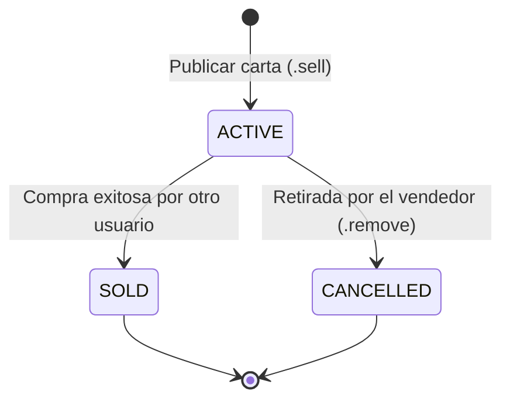

# 🏪 Mercado Libre de Cartas (Marketplace)

## 1. Concepto

El mercado permite a los jugadores publicar cartas de su inventario para venderlas a otros usuarios del mismo servidor de Discord a cambio de monedas.

---

## 2. Estados de una Oferta (`MarketOfferStatus`)

Las ofertas en el mercado siguen un ciclo de vida con estados en base de datos:

* **`ACTIVE`:** Disponible en el mercado para cualquier usuario del servidor.
* **`SOLD`:** Comprada. La carta se transfirió al comprador y las monedas al vendedor.
* **`CANCELLED`:** Retirada por el vendedor; la carta regresa a su inventario.

---

## 3. Exploración y Compra (`.market`)

1. **Apertura de Mercado:** Al invocar `.market`, el bot responde con un botón interactivo *"Open Market"*.
2. **Navegación:** Permite explorar todas las ofertas activas en el servidor mediante paginación.
3. **Compra Segura:**
   * El comprador no puede ser el mismo vendedor.
   * El comprador debe contar con saldo suficiente (`balance >= price`).
   * La operación se realiza de forma atómica en el backend registrando los asientos contables en `Transaction`.
