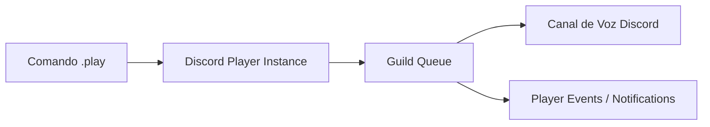

# 🎵 Reproductor de Música (discord-player)

## 1. Arquitectura de Música

Smilbot utiliza **`discord-player`** y **FFmpeg** para la reproducción de audio en canales de voz de Discord con soporte para colas de reproducción (*queues*).

---

## 2. Características del Sistema de Música

* **Soporte de Búsquedas y URLs:** Permite buscar por texto o pegar enlaces directos de plataformas soportadas (YouTube, Spotify, etc. vía extractores).
* **Gestión de Colas por Servidor:** Cada servidor posee una cola de reproducción independiente con estado de pista actual, volumen y canciones siguientes.
* **Auto-desconexión:** Maneja eventos de desconexión si el canal de voz se vacía o termina la lista de reproducción.

---

## 3. Eventos del Reproductor (`src/events/player/`)

* `playerStart`: Notifica al canal de texto cuando comienza a reproducirse una nueva pista.
* `audioTrackAdd`: Notifica cuando una canción se añade a la cola.
* `disconnect` / `emptyChannel`: Libera los recursos de voz y limpia la cola.
* `error` / `playerError`: Captura excepciones de streaming y emite advertencias.
